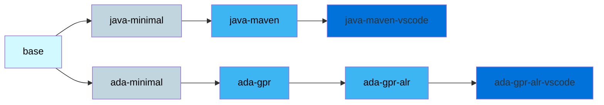

# images-development

A collection of Docker images for development with main programming languages.

They can be used alone but are designed to work with the [Onyxia](https://github.com/InseeFrLab/onyxia) ecosystem.

## Layouts

